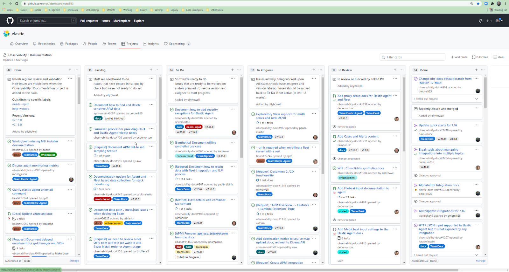

## Observability :: Documentation

To see what we're working on, view our main [Github project board][0].

To request support, you can create an issue in our main public repo: [https://github.com/elastic/observability-docs][1]

[][0]

## Obs Docs Projects

We are playing with GitHub Projects Beta to manage additional projects and experiment with Views etc.

<DocBadge template="experimental" />[Obs Docs Projects][2]

[0]: https://github.com/orgs/elastic/projects/513
[1]: https://github.com/elastic/observability-docs
[2]: https://github.com/orgs/elastic/projects/649/views/4
